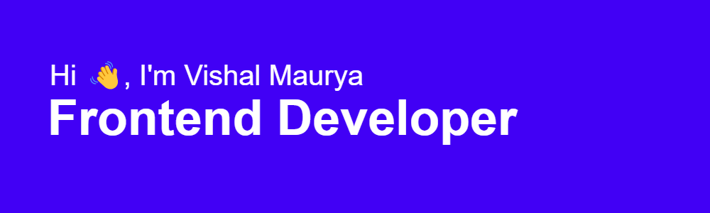

 
 

Hi My name is Vishal Maurya
=====================================================================================================================================

Frontend Developer
------------------

I am a Frontend Developer based in India with a knack for building things. In my spare time, I enjoy playing Valorant. I am currently looking for front-end development jobs.

* 🌍  I'm based in India
* 🖥️  See my portfolio at [Portfolio](http://v1shal.vercel.app)
* ✉️  You can contact me at [mauryav518@gmail.com](mailto:mauryav518@gmail.com)
* 🚀  I'm currently working on [My Portfolio](http://v1shal.vercel.app)
* 🧠  I'm learning React JS
* 🤝  I'm open to collaborating on Interesting Projects

### Skills

### Socials

       

### Badges

<b>Top Repositories</b>

       

### Support Me

